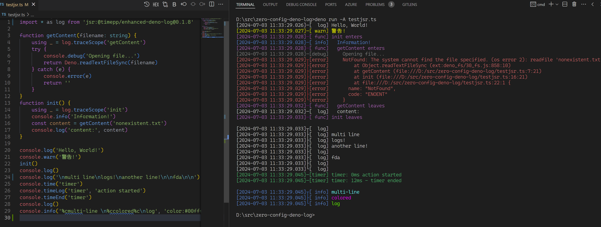
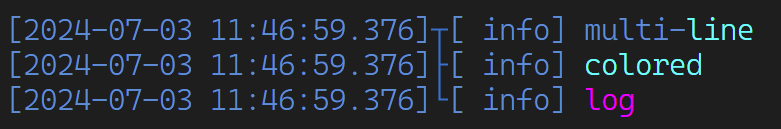
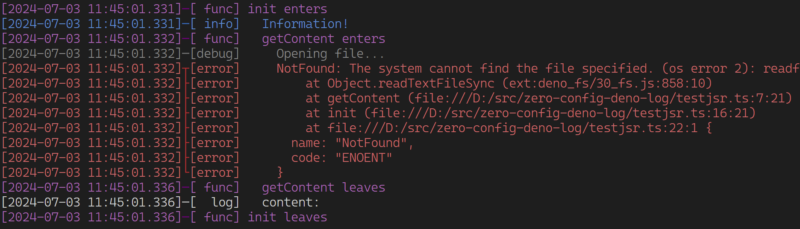

# Enhanced Deno Log

Add timestamp, levels, coloring by levels, log to files and indentions to Deno's `console` API with zero configuration.

> Note: https://jsr.io/@timepp/zero-config-deno-log is the old name, it contains versions up to 0.1.7 and won't be updated anymore. Please use https://jsr.io/@timepp/enhanced-deno-log instead.

## Features

- Colored output for errors(red), warnings(yellow), infos(blue), debugs(gray), timers(green)
- Each log is prefixed with timestamp and log level; for multi-line logs, each log line is prefixed with timestamp and log level individually so that they are aligned and easy to read
- Log files are automatically created in `./logs` folder, with the entrypoint script name as the file name
- This module changes `console.xxx` behavior globally, so all your existing code will automatically have these features with zero configuration; you can customize detailed behavior if needed
- Support auto indention via 'traceScope' using the latest typescript `using` syntax



## Usage

Recommended (simplest) usage: Use default settings and new log take effect immediately. No need to explicitly init the log.

```typescript
import 'jsr:@timepp/enhanced-deno-log/autoinit'
```

If you want to customize other behaviors, e.g. colors:

```typescript
import * as log from 'jsr:@timepp/enhanced-deno-log/autoinit'
...
log.setColors(...) // see advanced usage section
```

If you dont want auto init and control when to enable the enhanced log:

```typescript
import * as log from 'jsr:@timepp/enhanced-deno-log'
...
log.init()
```

## Advanced Usage

### Customizing log behavior

In rare cases you may want to customize the log behavior, you can call `log.xxx`.

```ts

// change date format:
log.setDateFormat('yyyy-MM-dd HH:mm:ss.SSS')

// set empty line prefix behavior:
log.prefixEmptyLines(true)

// set warn and timer color
log.setColors({ warn: 'lime', timer: '#00FFFF' })
```

Refer to their document for more details.

### Existing colored logs

You can still use colored logs, in this case the base color of the line is decided by level, and your colors are fully respected in the content area.

```ts
console.info('multi-%cline \ncolored%c\nlog', 'color:#00ffff', 'color:#ff00ff')
```



### Auto indentions

You can use `traceScope` and `traceFunction` to automatically indent/unindent logs when code enters/leaves scopes.
If there are deep nested functions, it will make logs more readable.

- `traceScope` takes a string as the scope name
- `traceFunction` doesn't take any argument, it will retrieve the function name (from error stack) as the scope name

```ts
function init() {
    using _ = log.traceScope('init')
    console.info('Information!')
    const content = getContent('file.txt')
    console.log('content:', content)
}
function getContent(filename: string) {
    using _ = log.traceFunction()
    try {
        using _ = log.traceScope('read file')
        console.debug('file name:', filename)
        return Deno.readTextFileSync(filename)
    } catch (e) {
        console.error(e)
        return ''
    }
}
```

The corresponding log could be:


Unfortunately, different async promise chain will interfere with each other when they are running in parallel. So use this feature with caution.
