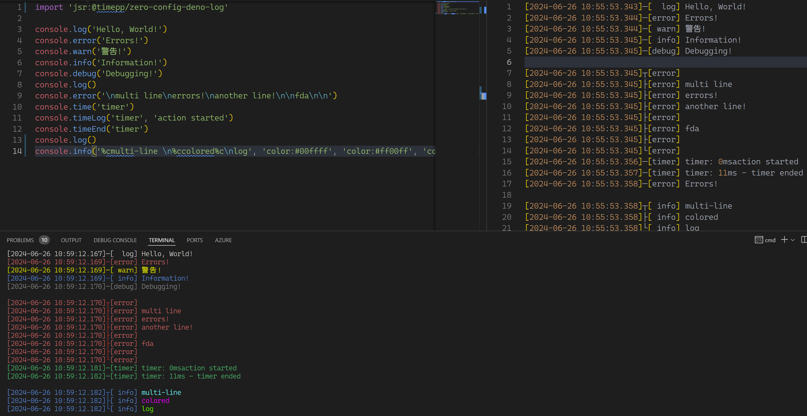

# optimized deno log with zero configuration



## Features

- Zero configuration, changing `console.xxx` behavior globally
- Colored output for errors(red), warnings(yellow), infos(blue), debugs(gray), timers(green)
- Each log is prefixed with timestamp and log level; for multi-line logs, each log line is prefixed with timestamp and log level individually so that they are aligned and easy to read
- Log files are automatically created in `./logs` folder, with the entrypoint script name as the file name

## Usage

in your entrypoint file:
```
import 'jsr:@timepp/zero-config-deno-log'
```

That's it.

## Advanced Usage

In rare cases you may want to customize the log behavior.

```ts
import * as dl from 'jsr:@timepp/zero-config-deno-log'

// change date format:
dl.setDateFormat('m-d H:M:S')

// set empty line prefix behavior:
dl.prefixEmptyLines(true)

```